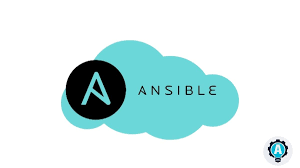
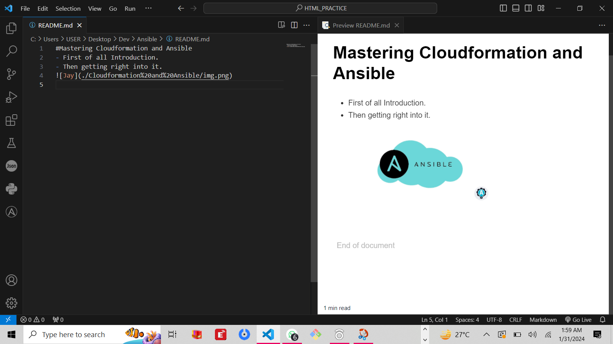
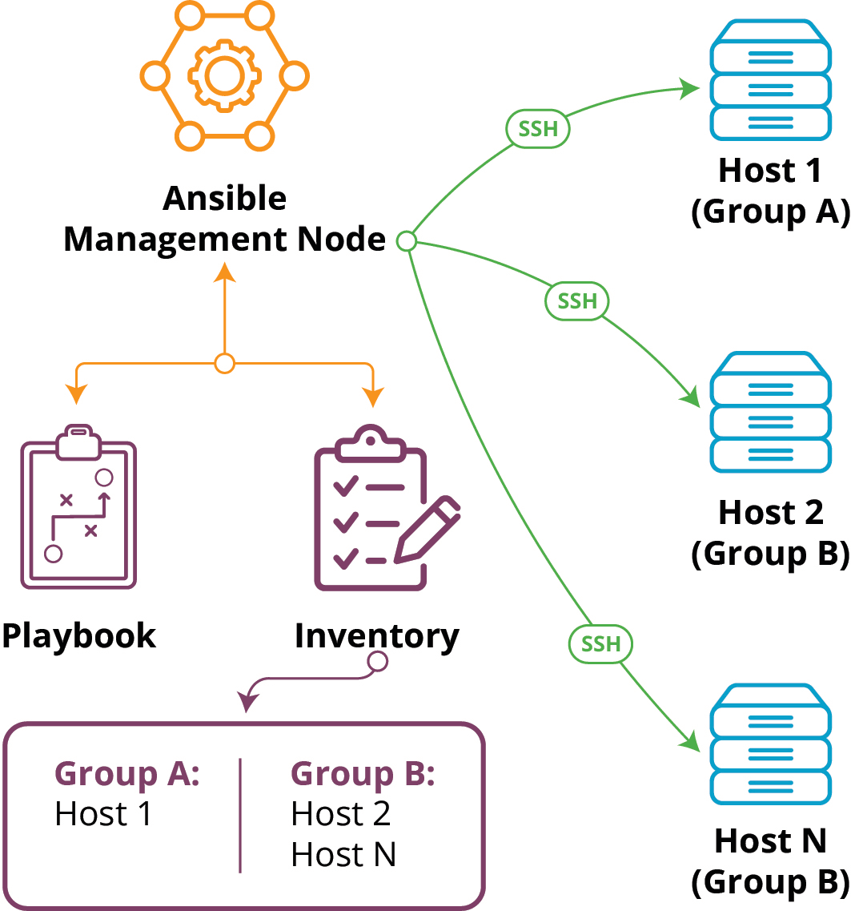

# Mastering Cloudformation and Ansible. 

## What is Ansible

Ansible is a Python-based, open-source, command-line tool for IT automation developed by Red Hat. It automates many manual IT processes, including provisioning, configuration managem
ent, application deployment, and orchestration.

## What is Cloudformation
AWS CloudFormation is an infrastructure as code (IaC) service that allows you to easily model, provision, and manage AWS and third-party resources.

## Objetive
We'll be using Cloudformation and Ansible to create and configure our cloud environment.

## Project Steps
> Create a virtual Environment and install Ansible

!
-
-
-
-

# The End.# Sampling-Readme.md-to-Github
# Sampling-Readme.md-to-Github
